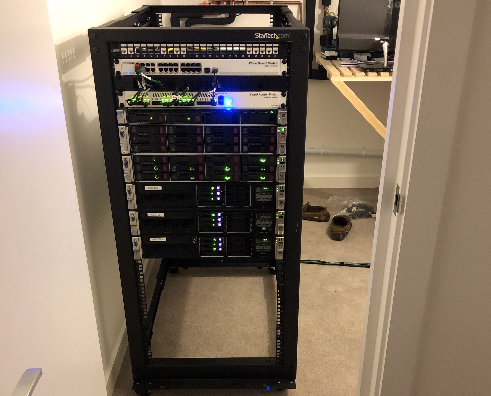
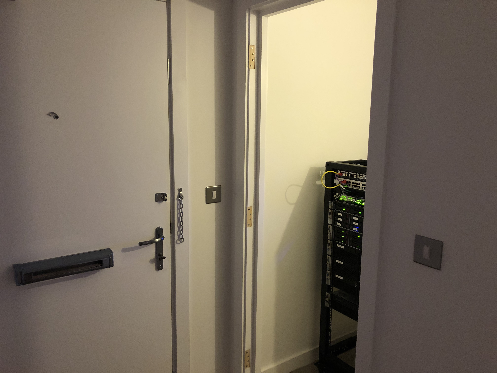
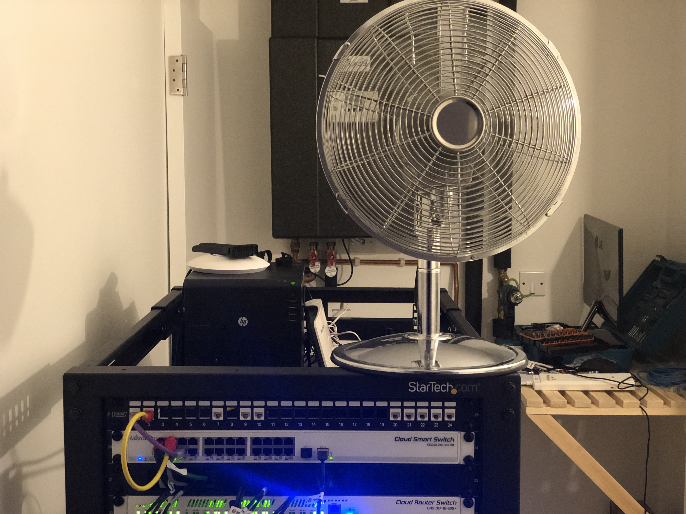

So it was time to move to a new home, and as everyone knows, the top priority for any new place of residence is somewhere to keep the server rack.
Luckily for me, this place conveniently came with a cupboard that was perfect for the job. I'm sure this was the intended use case when designed the place.

While it may seem perfect from the get go, there were a few adjustments that needed to be made. Cupboards are known for not having any airflow, and this is a big problem if you intend on using them for a server rack. 
The easiest solution was to keep the door open and let the air flow in, as the servers are quiet enough.

The main problem with this solution is the pesky door, that was now in the way of the front door whenever we wanted to leave.

Oh look, an easy solution. How wonderful. Im sure the door wasnt needed anyway.
So at this point it seemed perfect, so off I went to bed, having moved all of my stuff and setup the rack in the same day.

Upon waking up, it was clear this wasn't a perfect solution. The cupboard had heated up significantly, causing the fans to spin up to an uncomfortable volume.
At this point we were getting worried, and we were thinking of the worst case scenario, putting the rack in the living room where there is more airflow.
After thinking this over a little bit, we decided to try a more simple solution.

Ah yes, a cheap, terrible, desk fan. So we placed it there, hoping it would circulate enough air to keep this place at a reasonable temperature. Luckily for us, it seemed to be doing the job.

Im sure in the future we will find a more suitable fan for the job, and maybe not have it balancing on the corner of the rack, but its probably not gonna happen since this solution works.

